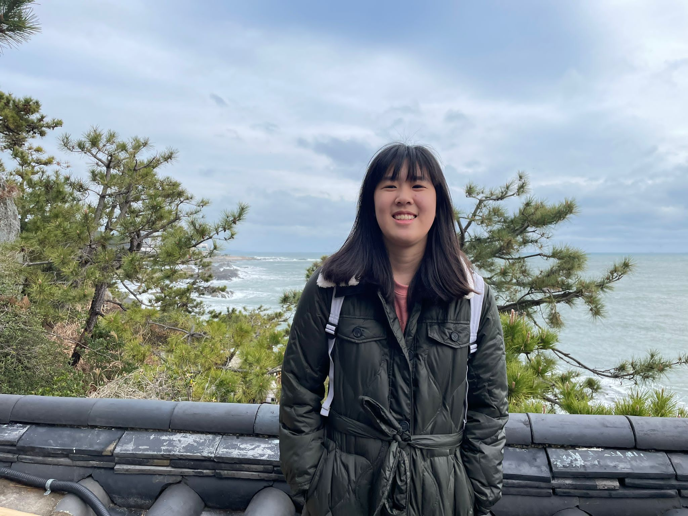
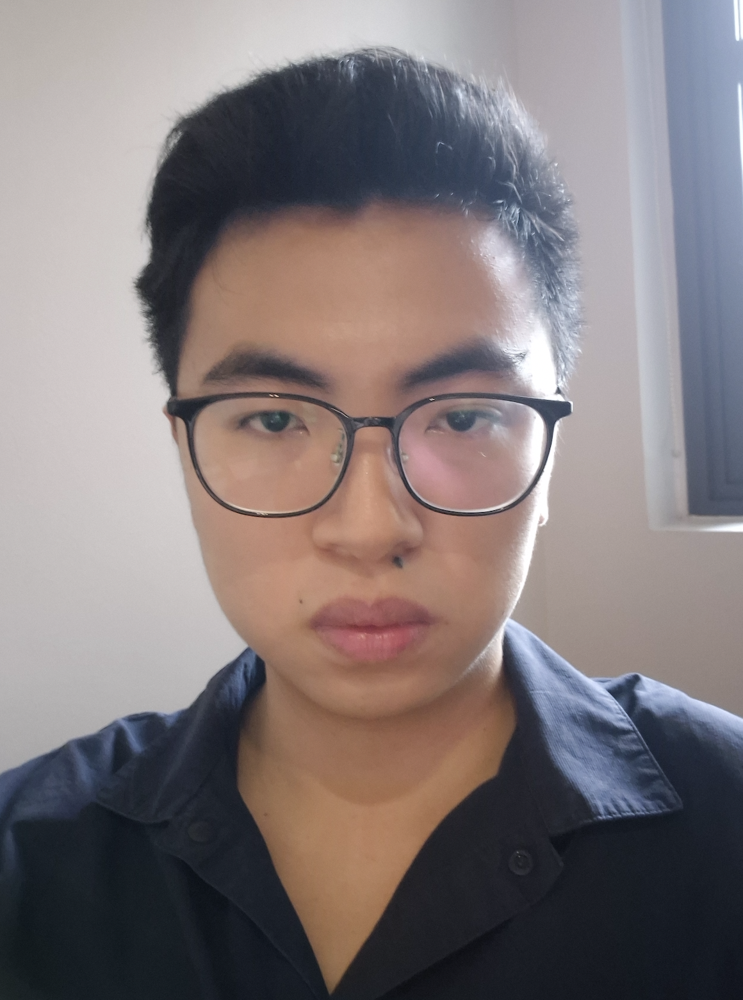
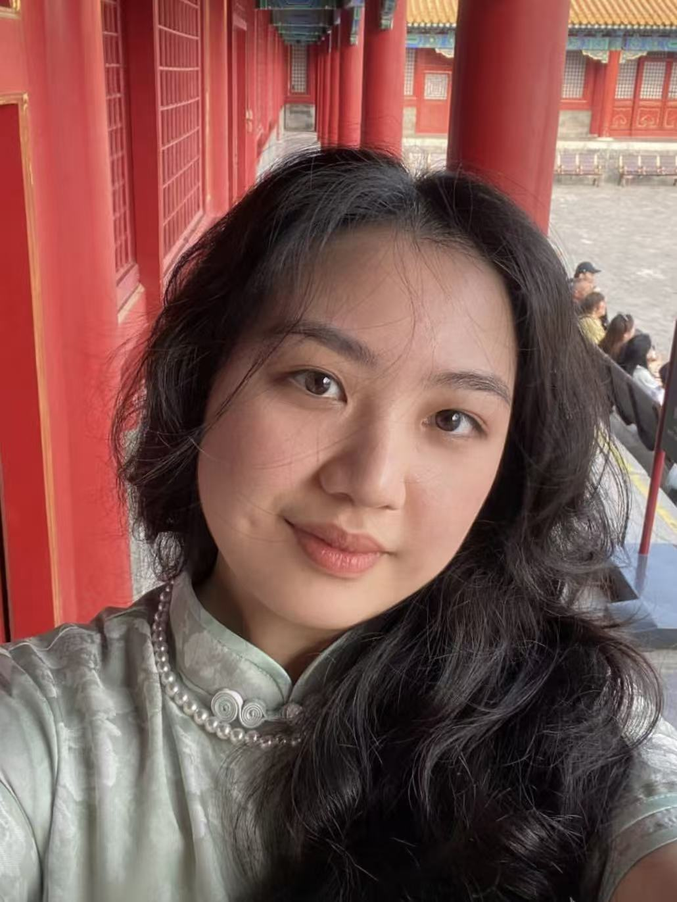
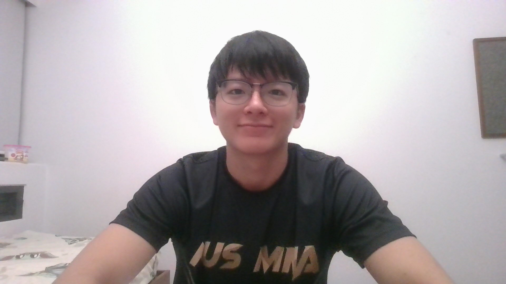

# About Us

We are a team based in the [School of Computing, National University of Singapore](http://www.comp.nus.edu.sg).

You can reach us at the email `seer[at]comp.nus.edu.sg`

## Project team

### Sahishnu Kumaar

[[homepage](https://www.sahishnu.dev/)]
[[github](https://github.com/sahishnuk2)]
[[portfolio](team/johndoe.md)]

* Role: Project Advisor

### Phoebe Yap

[[github](http://github.com/PhoebeY05)]
[[portfolio](team/johndoe.md)]

* Role: Team Lead
* Responsibilities: UI

### Ng Jun Hao

[[github](http://github.com/junhao4)] [[portfolio](team/johndoe.md)]

* Role: Developer
* Responsibilities: Data

### Xiao Wenli

[[github](http://github.com/xwl42)]
[[portfolio](team/johndoe.md)]

* Role: Developer
* Responsibilities: Dev Ops + Threading

### Thomas

[[github](http://github.com/thomas5564)]
[[portfolio](team/johndoe.md)]

* Role: Developer
* Responsibilities: UI
