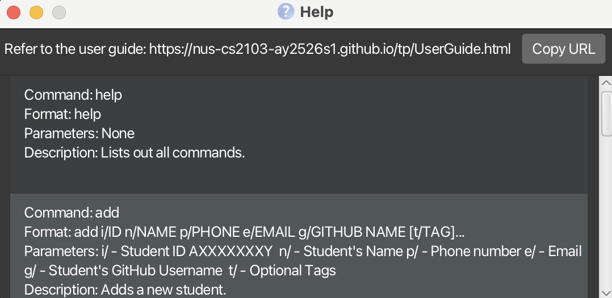

# LambdaLab User Guide

LambdaLab is a desktop app for **CS2030S Teaching Assistants** to **manage student records**, optimised for use via a
Command Line Interface (CLI) while still having an intuitive Graphical User Interface (GUI). If you are a fast typer,
LambdaLab can help you track student information, lab attendance, and exercise submissions even faster than traditional
spreadsheets or GUI apps.

## About this guide

This guide is written for CS2030S teaching assistants who need to maintain student records, mark lab attendance and exercises,
and manage consultation timeslots. Assumed prior knowledge:
- Comfortable using a command terminal on Windows / macOS / Linux.
- Basic familiarity with editing plain text (copy/paste commands).
- Understands core CS2030S concepts (labs, exercises, student identifiers).

How to use this guide:
- Quick start: run the application and try a few example commands.
- Features: detailed command syntax, examples, and expected output.
- Troubleshooting: common errors and remedies are highlighted near each command.

## Table of Contents

1. [Quick start](#quick-start)
2. [Features](#features)<br>
   (1) [Viewing help: `help`](#viewing-help-help)<br>
   (2) [Listing all students: `list`](#listing-all-students-list)<br>
   (3) [Adding a student: `add`](#adding-a-student-add)<br>
   (4) [Editing a student: `edit`](#editing-a-student-edit)<br>
   (5) [Marking lab attendance: `marka`](#marking-lab-attendance-marka)<br>
   (6) [Marking exercise status: `marke`](#marking-exercise-status-marke)<br>
   (7) [Setting current week: `set-week`](#setting-current-week-set-week)<br>
   (8) [Assigning assessment score: `grade`](#assigning-assessment-score-grade)<br>
   (9) [Locating students: `find`](#locating-students-by-name-find)<br>
   (10) [Sorting students: `sort`](#sorting-the-students-sort)<br>
   (11) [Deleting a student: `delete`](#deleting-a-student-delete)<br>
   (12) [Clearing all entries: `clear`](#clearing-all-entries-clear)<br>
   (13) [Undoing the last command: `undo`](#undoing-the-last-command-undo)<br>
   (14) [Timeslots & Consultations](#timeslots--consultations)<br>
       &nbsp;&nbsp;&nbsp;(a) [Blocking a timeslot: `block-timeslot`](#blocking-a-timeslot-block-timeslot)<br>
       &nbsp;&nbsp;&nbsp;(b) [Unblocking a timeslot: `unblock-timeslot`](#unblocking-a-timeslot-unblock-timeslot)<br>
       &nbsp;&nbsp;&nbsp;(c) [Retrieving merged timeslot ranges: `get-timeslots`](#retrieving-merged-timeslot-ranges-get-timeslots)<br>
       &nbsp;&nbsp;&nbsp;(d) [Retrieving consultations only: `get-consultations`](#retrieving-consultations-only-get-consultations)<br>
       &nbsp;&nbsp;&nbsp;(e) [Clearing all timeslots: `clear-timeslots`](#clearing-all-timeslots-clear-timeslots)<br>
       &nbsp;&nbsp;&nbsp;(f) [Adding a consultation: `add-consultation`](#adding-a-consultation-add-consultation)<br>
   (15) [Exiting the program: `exit`](#exiting-the-program-exit)<br>
   (16) [Saving the data](#saving-the-data)<br>
   (17) [Editing the data file](#editing-the-data-file)<br>
3. [FAQ](#faq)
4. [Known issues](#known-issues)
5. [Command summary](#command-summary)

---

<page-nav-print />


## Quick start

1. Ensure you have **Java 17** or above installed on your computer.<br>
> **Checking your Java version:**
> * Open a command terminal
> * Type `java -version` and press Enter
> * If Java is installed, you'll see the version number (e.g., `java version "17.0.1"`)
> * The first number should be 17 or higher
>
> **If Java is not installed or the version is below 17:**
> * Download and install Java 17 by following the guide:
>   * [for Windows users](https://se-education.org/guides/tutorials/javaInstallationWindows.html)
>   * [for Mac users](https://se-education.org/guides/tutorials/javaInstallationMac.html)
>   * [for Linux users](https://se-education.org/guides/tutorials/javaInstallationLinux.html)
> * After installation, restart your terminal and verify the version again

2. Download the latest `.jar` file from [here](https://github.com/AY2526S1-CS2103T-T09-3/tp/releases).

3. Copy the `.jar` file to the folder you want to use as the _home folder_ for your LambdaLab.

4. Open a command terminal, `cd` into the folder you put the `.jar` file in, and use the `java -jar addressbook.jar` command to run the application.<br>
   A GUI similar to the below should appear in a few seconds. Note that the app contains some sample data and the layout
   is explained in coloured boxes.<br>
   

### Quick CLI tutorial
- Click the command input box (bottom of the UI), type a command exactly as shown (prefixes like `n/`, `i/`, `ts/` are required), then press Enter.
- Typical response types:
    - Success message with brief summary.
    - List output (e.g., `list`, `find`) showing matching student entries.
    - Error message starting with `Invalid command format!` or a validation message — read it carefully and retry.
- Example sequence:
    1. `add i/A1234567X n/John Doe p/98765432 e/john@example.com g/johndoe`
        - Expected output: "New student added: John Doe"
    2. `list`
        - Expected output: numbered list including "John Doe".
    3. `undo`
        - Expected: restores previous state, shows "Undo successful" or a message indicating nothing to undo.

5. Type your command in the command box and press Enter to execute it. <br>
   Some example commands you can try:

    * `help` : Shows the help window that explains the command usage.

    * `list` : Lists all students' records.

    * `add i/A1234567X n/John Doe p/98765432 e/johnd@example.com g/JohnDoe t/ModelStudent`: Adds a student named `John Doe` to the record.

    * `delete 3` : Deletes the 3rd student's record shown in the current list.

    * `clear` : Deletes all students' records.

    * `exit` : Exits the app.

6. Refer to the [Features](#features) below for details of each command.

--------------------------------------------------------------------------------------------------------------------

## Features

<box type="info">

**Notes about the command format:**<br>

* Words in `UPPER_CASE` are the parameters to be supplied by the user.<br>
  e.g. in `add n/NAME`, `NAME` is a parameter which can be used as `add n/John Doe`.

* Items in square brackets are optional.<br>
  e.g `n/NAME [t/TAG]` can be used as `n/John Doe t/friend` or as `n/John Doe`.

* Items with `…`​ after them can be used multiple times including zero times.<br>
  e.g. `[t/TAG]…​` can be used as ` ` (i.e. 0 times), `t/friend`, `t/friend t/family` etc.

* Parameters can be in any order.<br>
  e.g. if the command specifies `n/NAME p/PHONE_NUMBER`, `p/PHONE_NUMBER n/NAME` is also acceptable.

* Extraneous parameters for commands that do not take in parameters (such as `help`, `list`, `exit` and `clear`) will be ignored.<br>
  e.g. if the command specifies `help 123`, it will be interpreted as `help`.

* If you are using a PDF version of this document, be careful when copying and pasting commands that span multiple lines as space characters surrounding line-breaks may be omitted when copied over to the application.
  </box>

<br><br>
### Viewing help: `help`

Opens a Help window that provides a link to the User Guide.

It also gives a brief explanation of each command.

Format: `help`



<br><br>
### Listing all students : `list`

Shows a list of all students and their information.

Format: `list`

<br><br>
### Adding a student: `add`

Adds a student to LambdaLab.

Format: `add i/STUDENTID n/NAME p/PHONE e/EMAIL g/GITHUB_USERNAME [t/TAG]…​`

<box type="tip">

**Tip:** A student can have zero or more tags.  
A tag must be alphanumeric with no spaces or special characters.
</box>

Examples:
* Compulsory fields only: `add i/A1234567X n/John Doe p/98765432 e/johnd@example.com g/JohnDoe`
* Optional fields included: `add i/A1234567X n/John Doe p/98765432 e/johnd@example.com g/JohnDoe t/modelStudent`
* Fields in different order: `add g/JohnDoe i/A1234567X  p/98765432 t/modelStudent n/John Doe e/johnd@example.com`

<box type="warning">

Duplicate identifier (Student ID) will cause the below error:  
`This student already exists in LambdaLab`
</box>


<br><br>
### Editing a student : `edit`

Edits an existing student in LambdaLab.

Format: `edit INDEX [i/STUDENT ID] [n/NAME] [p/PHONE] [e/EMAIL] [g/GITHUB USERNAME] [t/TAG]…​`

* Edits the student at the specified `INDEX`.
  The index refers to the index number shown in the displayed student list.
  The index **must be a positive integer** 1, 2, 3, …​
* You must provide at least 1 of the optional fields.
* Existing values will be updated to the input values.

<box type="warning">

**Caution:**

When editing tags, the existing tags of the student will be removed
i.e adding of tags is not cumulative.
You can remove all the student’s tags by typing `t/` without
specifying any tags after it.

</box>

Examples:
*  `edit 1 p/91234567 e/johndoe@example.com` Edits the phone number and email address of the 1st student to be `91234567` and `johndoe@example.com` respectively.
*  `edit 2 n/Betsy Crower t/` Edits the name of the 2nd student to be `Betsy Crower` and clears all existing tags.

<br><br>
### Marking lab attendance: `marka`

Marks the lab attendance of an existing student in LambdaLab.

Format: `marka INDEX l/LABNUMBER s/ATTENDANCESTATUS`

* Edits the student at the specified `INDEX`. The index refers to the index number shown in the displayed student list. The index **must be a positive integer** 1, 2, 3, …​
* `LABNUMBER` represents the lab session to mark attendance for. It **must be between 1 and 10 (inclusive)**.
* `ATTENDANCESTATUS` represents the current status of the student's attendance. It **must be one of `y` or `n` (case-insensitive)**

Examples:
* `marka 2 l/7 s/y` marks Lab 7 of the second student as attended.
* `marka 2 l/7 s/n` marks Lab 7 of the second student as not attended.

<br><br>
### Marking exercise status: `marke`

Marks the exercise status of an existing student in LambdaLab.

Format: `marke INDEX ei/EXERCISENUMBER s/STATUSLETTER`

* Edits the student at the specified `INDEX`. The index refers to the index number shown in the displayed student list. The index **must be a positive integer** 1, 2, 3, …​
* `EXERCISE` represents the lab session to mark attendance for. It **must be between 0 and 9 (inclusive)**.
* `STATUS` represents the status to mark the exercise with. It **must be a letter chosen from the following**:

| Letter  | Status Name | Meaning                              |
|---------|-------------|--------------------------------------|
| `D`/`d` | Done        | The exercise is completed.           |
| `N`/`n` | Not Done    | The exercise has not been completed. |
| `O`/`o` | Overdue     | The exercise is overdue or late.     |
* Each exercise only has **one status**.

Examples:
* `marke 2 ei/7 s/d` marks exercise 7 of the 2nd student as done.

<br><br>
### Setting current week: `set-week`

Sets the current week of the semester to the specified week.

Format: `set-week WEEKNUMBER`

* Marks the lab attendance of past labs as absent if not attended
* Marks the overdue exercises as overdue if not complete (*to be implemented*)
* `WEEKNUMBER` represents the NUS Semester week, and it **must be between 0 and 13 inclusive**

Examples:
* `set-week 5` will set current week at 5. Labs 1 to 2 will be marked as absent (red) if they have not been attended.

<br><br>
### Assigning assessment score: `grade`

Assigns the score for a specific assessment of an existing student in LambdaLab.

Format: `grade INDEX en/EXAMNAME sc/SCORE`

* Edits the student at the specified `INDEX`. The index refers to the index number shown in the displayed student list. The index **must be a positive integer** 1, 2, 3, …​
* `EXAMNAME` specifies the name of the assessment.
* `SCORE` specifies the score to assign for that assessment.  
  It **must be between 0 and the assessment’s maximum achievable score (inclusive)**.

Supported Assessments:

| Assessment | Maximum Score |
|-------------|---------------|
| `pe1`       | 40            |
| `midterm`   | 60            |
| `pe2`       | 40            |
| `final`     | 100           |

Examples:
* `grade 2 en/midterm sc/55` sets the **midterm** score of the **2nd student** in the list to **55**.

<br><br>
### Locating students: find
Finds students whose specified fields contain any of the given keywords.
Format: `find KEYWORD [MORE_KEYWORDS]... [i/] [n/] [p/] [e/] [g/] [t/]`

| Field Prefixes | Search by       |
|----------------|-----------------|
| `i/`           | student ID      |
| `n/`           | name            |
| `p/`           | phone number    |
| `e/`           | email           |
| `g/`           | Github username |
| `t/`           | tags            |

* If you do not specify any field prefixes after the keywords, all fields are searched by default.
* The search is case-insensitive. e.g., hans will match Hans
* The order of keywords does not matter. e.g., `Hans Bo will` match `Bo Hans`
* Students matching at least one keyword will be returned (i.e., OR search). e.g., `Hans Bo` will return `Hans Gruber` and `Bo Yang`

Examples:
* `find John` - Returns students with `john` or `John` in any field (name, student ID, email, etc.)
* `find alex david` - Returns students with `alex` or `david` in any field
* `find alice bob n/` - Returns students with `alice` or `bob` in their name only
* `find alice bob A1231234B i/ n/` - Returns students with `alice`, `bob`, or `A1231234B` in their student ID or name

<box type="tip">
Tip: Use multiple field prefixes to narrow your search to specific fields. For example, `find alice n/` searches for
`alice` only in names, ignoring other fields.
</box>

<br><br>
### Filtering students: `filter`

Filters and shows only the students who satisfy the given lab attendance 
and exercise completion statuses.

Format: `filter [l/LABNUMBER s/ATTENDANCESTATUS] [ei/EXERCISEINDEX s/EXERCISESTATUS]`

| Prefix           | Meaning                             | Accepted values                                                                              |
|------------------|-------------------------------------|----------------------------------------------------------------------------------------------|
| `l/`             | Lab number to check attendance for  | **1–10** (inclusive)                                                                         |
| `ei/`            | Exercise number to check status for | **0–9** (inclusive)                                                                          |
| `s/` after `l/`  | Attendance status for that lab      | `y` (attended), `n` (not attended yet), `a` (absent)(not implemented yet) — case-insensitive |
| `s/` after `ei/` | Exercise status for that exercise   | `d` (done), `n` (not done), `o` (overdue) — case-insensitive                                 |


* You **must** provide one `s/STATUS` immediately after each `l/LABNUMBER` or `ei/EXERCISEINDEX` you include.
* If you use filter for both labs and exercises, they are combined with **AND**
(a student must satisfy both conditions to be shown).
* Status letters are case-insensitive (`Y`, `y`, `D`, `d`, etc.).

Examples:
* `filter l/7 s/y` — Shows students who attended Lab 7.
* `filter l/3 s/n` — Shows students absent for Lab 3.
* `filter ei/5 s/d` — Shows students who completed Exercise 5.
* `filter ei/0 s/o` — Shows students with Exercise 0 overdue.
* `filter l/2 s/y ei/4 s/d` — Shows students who attended Lab 2 and completed Exercise 4.


<box type="tip">
Use `list` to clear the filter and show everyone again.
</box>


Filters students by their lab attendance and exercise completions.

<br><br>
### Sorting the students: `sort`

Sorts the student by a specified criterion.

Format: `sort c/SORTCRITERION`

* `SORTCRITERION` determines how the student list should be sorted. It must be one of the following:
  * `name` sorts students by their name (alphabetically)
  * `id` sorts students by their Student Id
  * `lab` sorts students by their Lab Attendance Rate (Highest to lowest)
  * `ex` sorts students by their progress in their exercises (Highest to lowest)

<box type="tip">

**Tip:** The criterion is case-insensitive. 
Also note that `sort` cannot be undone through `undo`. However, you can always sort it base on another criterion again. 
</box>

Examples:
* `sort c/name` sorts the students by their name.
* `sort c/lab` sorts the students by their lab attendance rate.

<br><br>
### Deleting a student : `delete`

Deletes the specified student from LambdaLab.

Format: `delete INDEX`

* Deletes the student at the specified `INDEX`. The index refers to the index number shown in the **displayed** student list. The index **must be a positive integer** 1, 2, 3, …​

Examples:
* `list` followed by `delete 2` deletes the 2nd student in the LambdaLab.
* `find Betsy` followed by `delete 1` deletes the 1st student in the results of the `find` command.

<box type="warning">

Missing fields or a non‑positive index will cause the following error:  
`Invalid command format! 
  delete: Deletes the student identified by the index number used in the displayed student list.
  Parameters: INDEX (must be a positive integer)
  Example: delete 1`
</box>

<br><br>
### Clearing all entries : `clear`

Clears **all** entries from LambdaLab, leaving it completely empty.

Format: `clear`

<box type="warning">

**Caution:**
This command will remove **all** entries from LambdaLab. If mistakenly performed, type `undo` **immediately**
before using another data-modifying command.
</box>

<br><br>
### Undoing the last command: `undo`

Reverses the most recent command that modified student data in LambdaLab.

Format: `undo`

* Only commands that change student data can be undone (e.g., `add`, `delete`, `edit`, `marka`, `marke`, `clear`, `set-week`, `block-timeslot`, etc.).
* Commands that do not modify data cannot be undone (e.g., `sort`, `help`, `list`, `find`, `get-timeslots`, `exit`, etc.).
* `undo` only reverses the very last data‑modifying command. If there is no command to undo, an error message will be displayed.

<box type="warning">

**Caution:**
This command only undoes the most recent data-modifying command. You cannot undo multiple data-modifying commands or skip
back to earlier changes.
</box>

<box type="tip">

**Tip:** Use `undo` immediately after making a mistake to quickly restore your previous data state.
</box>

Examples:
* `delete 2` followed by `undo` restores the deleted student back to the list
* `edit 1 n/Wrong Name` followed by `undo` reverts the student's name to its original value
* `add n/John Doe p/12345678 e/john@u.nus.edu a/College Avenue` followed by `undo` removes the newly added student
* `delete 2` followed by `list` followed by `undo` still restores the deleted student back to the list
* `delete 1` followed by `edit 1 n/Wrong Name` followed by 2 consecutive `undo`s only reverts the student's name
  to its original value, but cannot restore the deleted student back to the list

<br><br>
## Timeslots & Consultations

This section contains commands for managing unavailable times (blocked timeslots) and consultations. Timeslots can be used to mark regular events (e.g., classes), while consultation timeslots are specifically for CS2030S consultation sessions. These commands are designed to help users schedule and organize their consultation times more effectively.

<box type="tip">

**Tip:** Use `get-timeslots` to see your full schedule and `get-consultations` for an uncluttered view of your consultation schedule.

</box>

<box type="warning">
Note on overlaps: LambdaLab prevents overlapping timeslots. If you try to add a timeslot that partially or fully overlaps an existing timeslot, the command will be rejected with an error ("A timeslot at the same time already exists."). This safeguard applies to both generic timeslots (block-timeslot) and consultations (add-consultation).
</box>


<br><br>
### Blocking a timeslot: `block-timeslot`

Adds a timeslot to the application's timeslot store.

Format: `block-timeslot ts/START_DATETIME te/END_DATETIME`

* Accepted datetime formats:
  * ISO_LOCAL_DATE_TIME: `2023-10-01T09:00:00`
  * Human-friendly: `d MMM uuuu, HH:mm` (e.g. `4 Oct 2025, 10:00`) or `d MMM uuuu HH:mm` (e.g. `4 Oct 2025 10:00`)

Examples:
* `block-timeslot ts/2025-10-04T10:00:00 te/2025-10-04T13:00:00`
* `block-timeslot ts/4 Oct 2025, 10:00 te/4 Oct 2025, 13:00`
* `block-timeslot ts/4 Oct 2025 10:00 te/4 Oct 2025 13:00`

<br><br>
### Unblocking a timeslot : `unblock-timeslot`

Removes or trims stored timeslots that overlap the specified datetime range. The command will remove exact matches, trim edges, or split stored timeslots that contain the unblock range.

Format: `unblock-timeslot ts/START_DATETIME te/END_DATETIME`

* Accepted datetime formats:
  * ISO_LOCAL_DATE_TIME: `2023-10-01T09:00:00`
  * Human-friendly: `d MMM uuuu, HH:mm` (e.g. `4 Oct 2025, 10:00`) or `d MMM uuuu HH:mm` (e.g. `4 Oct 2025 10:00`)

* If a stored timeslot exactly matches the unblock range, it is removed.
* If the unblock range is strictly inside a stored timeslot, the stored timeslot is split into two (before and after the unblock range).
* If the unblock range overlaps one end of a stored timeslot, the stored timeslot is trimmed accordingly.
* If no stored timeslot overlaps the provided range, the command reports an error.

Examples:
* `unblock-timeslot ts/2025-10-04T10:00:00 te/2025-10-04T13:00:00`
* `unblock-timeslot ts/4 Oct 2025, 11:00 te/4 Oct 2025, 12:00`
* `unblock-timeslot ts/4 Oct 2025 12:00 te/4 Oct 2025 14:00`


<box type="tip">

**Tip:** You can use `get-timeslots` to get the correctly formatted datetimes for the timeslot you want to unblock.
</box>

<br>

### Adding a consultation: `add-consultation`

Adds a consultation timeslot associated with a student's name. Consultation entries are shown specially (red background with student name label) in the Timetable view.

Format: `add-consultation ts/START_DATETIME te/END_DATETIME n/STUDENT_NAME`

* Accepted datetime formats are the same as for `block-timeslot` (ISO_LOCAL_DATE_TIME or human-friendly variants).
* The student name is stored with the timeslot and will be visible in the UI and saved to the data file.
* The Timetable window renders consultations with a distinct appearance (star icon and student name shown under the time label) for easier identification.

Examples:
* `add-consultation ts/2025-10-04T10:00:00 te/2025-10-04T11:00:00 n/John Doe`
* `add-consultation ts/4 Oct 2025, 10:00 te/4 Oct 2025, 13:00`
* `add-consultation ts/4 Oct 2025 10:00 te/4 Oct 2025 13:00`

<box type="warning">
Note on overlaps: the application prevents overlapping timeslots. If you try to add a timeslot that partially or fully overlaps an existing timeslot, the command will be rejected with an error ("A timeslot at the same time already exists."). This safeguard applies to both generic timeslots (block-timeslot) and consultations (add-consultation).
</box>

<br>

### Retrieving merged timeslot ranges: `get-timeslots`

Displays all timeslot ranges derived from stored timeslots.

Format: `get-timeslots`

* Allows the user to keep track of unavailable times for easier scheduling of consultations with students.
* The command shows merged ranges in a human-friendly date/time format.
    * Example:
      ```
      4 Oct 2025, 10:00 -> 4 Oct 2025, 13:00
      6 Oct 2025, 09:00 -> 6 Oct 2025, 11:30
      ```

* The UI can also display these ranges in the Timetable window (when available). Note that the Timetable view only shows timeslots between 08:00 and 23:00.
  


<br>

### Retrieving consultations only: `get-consultations`

Displays all consultation timeslot ranges derived from stored consultation entries (ignores generic blocked timeslots).

Format: `get-consultations`

* Useful when you want a quick overview of scheduled consultations (student-facing times) without other blocked times.
* Output is similar to `get-timeslots` but filtered to consultation entries only. The Timetable window can also display consultations specifically.

Example output:
```
4 Oct 2025, 10:00 -> 4 Oct 2025, 11:00  (Student: John Doe)
6 Oct 2025, 14:00 -> 6 Oct 2025, 14:30  (Student: Alice)
```

<br>
### Clearing all timeslots : `clear-timeslots`

Removes all stored timeslots (does not affect student records).

Format: `clear-timeslots`

<box type="warning">

**Caution:**
This will permanently remove all stored timeslots. There is no multi-step undo for timeslot clearing;
use immediately after a mistaken action if your environment supports undo of other operations.
</box>

<br>

### Exiting the program : `exit`

Exits the program.

Format: `exit`

<br>

### Saving the data

LambdaLab data are saved in the hard disk automatically after any command that changes the data. There is no need to save manually.

<br>

### Editing the data file

LambdaLab data are saved automatically as a JSON file `[JAR file location]/data/addressbook.json`. Advanced users are welcome to update data directly by editing that data file.

<box type="warning">

**Caution:**
If your changes to the data file makes its format invalid, LambdaLab will discard all data and start with an empty data file at the next run.  Hence, it is recommended to take a backup of the file before editing it.<br>
Furthermore, certain edits can cause the LambdaLab to behave in unexpected ways (e.g., if a value entered is outside the acceptable range). Therefore, edit the data file only if you are confident that you can update it correctly.
</box>


--------------------------------------------------------------------------------------------------------------------

## FAQ

**Q**: How do I transfer my data to another Computer?<br>
**A**:
1. Locate your data file on your current computer:
    - Navigate to the folder where your LambdaLab `.jar` file is located
    - Look for a folder named `data`
    - Inside, you'll find a file called `addressbook.json` - this contains all your student records
2. Install LambdaLab on your new computer:
    - Download the `.jar` file and place it in your desired folder
    - Run it once to generate the initial file structure
3. Transfer your data:
    - Copy the `addressbook.json` file from your old computer
    - On your new computer, navigate to `[JAR file location]/data/`
    - Replace the empty `addressbook.json` file with your copied file
4. Restart LambdaLab on your new computer to see all your student data
   <box type="tip">
   Tip: You can also backup your data regularly by copying the `addressbook.json` file to a secure location (e.g., cloud storage, USB drive).
   </box>

**Q**: Can I track multiple tutorial groups in LambdaLab?<br>
**A**: Currently, LambdaLab is designed to manage one tutorial group per data file. If you teach multiple tutorial
groups, you can maintain separate `.jar` files in different folders, each with its own data file.

**Q**: How do I keep track of which labs and exercises are current for CS2030S?<br>
**A**: LambdaLab allows you to mark labs 1-10 and exercises 0-9. You'll need to refer to the CS2030S course schedule
to determine which labs and exercises are currently active. We recommend keeping a note of the current week's lab
and exercise numbers.

**Q**: Can I export my student data to a spreadsheet?<br>
**A**: Currently, data is stored in JSON format in the `data/addressbook.json` file. Advanced users can manually convert
this to a spreadsheet format using external tools, but direct export functionality will be coming in v2.0.

**Q**: What should I do if a student's information changes (e.g., github username or email)?<br>
**A**: Use the `edit` command with the student's index number to update their information. For example:
`edit 1 g/newUserName e/newemail@u.nus.edu`

**Q**: Why can't I undo the `list` or `find` command?<br>
**A**: The `undo` command only works for commands that modify student data. Commands like `list`, `find`, and `help`
only display information without changing any data, so there's nothing to undo.

**Q**: How do I add GitHub usernames for students who don't have one yet?<br>
**A**: All students must have a GitHub username when first added to LambdaLab. If a student doesn't have one yet,
you can use a placeholder (e.g., "pending") and update it later using the `edit` command once they create their account.

**Q**: Can I mark attendance for a lab session that hasn't happened yet?<br>
**A**: Yes, LambdaLab allows you to mark any lab from 1-10. However, we recommend marking attendance only for completed
lab sessions to maintain accurate records.

--------------------------------------------------------------------------------------------------------------------

## Known issues

1. **When using multiple screens**, if you move the application to a secondary screen, and later switch to using only the primary screen, the GUI will open off-screen. The remedy is to delete the `preferences.json` file created by the application before running the application again.
2. **If you minimize the Help Window** and then run the `help` command (or use the `Help` menu, or the keyboard shortcut `F1`) again, the original Help Window will remain minimized, and no new Help Window will appear. The remedy is to manually restore the minimized Help Window.

--------------------------------------------------------------------------------------------------------------------

## Command summary

Action     | Format, Examples
-----------|----------------------------------------------------------------------------------------------------------------------------------------------------------------------
**Add**    | `add i/STUDENTID n/NAME p/PHONE e/EMAIL g/GITHUB_USERNAME [t/TAG]…​` <br> e.g., `add i/A1234567X n/James Ho p/22224444 e/jamesho@example.com g/JamesHo t/friend`
**Add consultation** | `add-consultation ts/START_DATETIME te/END_DATETIME n/STUDENT_NAME` <br> e.g., `add-consultation ts/2025-10-04T10:00:00 te/2025-10-04T11:00:00 n/John Doe`
**Clear**  | `clear`
**Delete** | `delete INDEX`<br> e.g., `delete 3`
**Edit**   | `edit INDEX [i/STUDENT ID] [n/NAME] [p/PHONE_NUMBER] [e/EMAIL] [g/GITHUB USERNAME] [t/TAG]…​`<br> e.g.,`edit 2 n/James Lee e/jameslee@example.com`
**Find**   | `find KEYWORD [MORE_KEYWORDS]`<br> e.g., `find James Jake`
**List**   | `list`
**Help**   | `help`
**Mark Attendance** | `marka INDEX l/LABNUMBER` <br> e.g. `marka 2 l/7`
**Mark Exercise** | `marke INDEX ei/EXERCISENUMBER s/STATUSLETTER` <br> e.g. `marke 2 ei/7 s/d`
**Set Week** | `set-week WEEKNUMBER` <br> e.g. `set-week 5`
**Sort**    | `sort`
**Undo** | `undo`
**Grade**| `grade`
**Block timeslot** | `block-timeslot ts/START_DATETIME te/END_DATETIME` <br> e.g. `block-timeslot ts/2025-10-04T10:00:00 te/2025-10-04T13:00:00`
**Unblock timeslot** | `unblock-timeslot ts/START_DATETIME te/END_DATETIME` <br> e.g. `block-timeslot ts/2025-10-04T10:00:00 te/2025-10-04T13:00:00`
**Get timeslots** | `get-timeslots` 
**Get consultations** | `get-consultations`
**Clear timeslots** | `clear-timeslots` 
**Exit**   | `exit`


