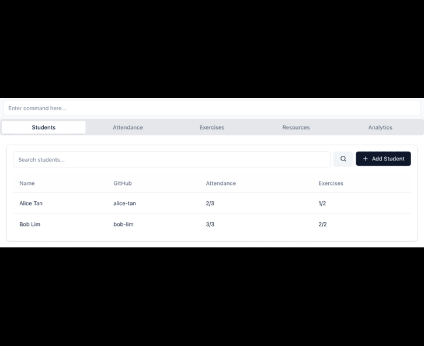
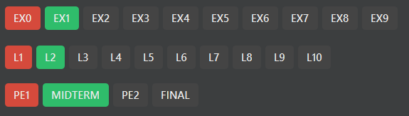
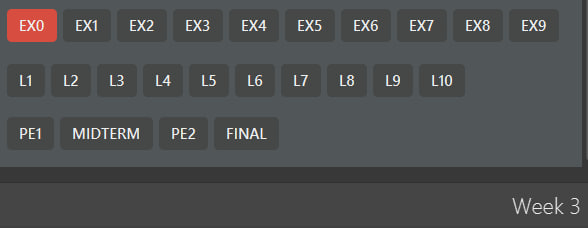

# LambdaLab User Guide

LambdaLab is a desktop app for **CS2030S Teaching Assistants** to maintain student records, mark lab attendance and exercises,
and manage consultation timeslots. It is optimised for use via a
Command Line Interface (CLI) while still having an intuitive Graphical User Interface (GUI). If you are a fast typer,
LambdaLab can help you track student information, lab attendance, and exercise submissions even faster than traditional
spreadsheets or GUI apps.

---

# Table of Contents
1. [Quick start](#quick-start)
2. [Features](#features)

<div style="margin-left: 20px; line-height: 1.2;">

2.1. [Data-modifying commands](#data-modifying-commands)

<div style="margin-left: 20px; line-height: 1.2;">

2.1.1. [On student data](#on-student-data)
- [Add](#adding-a-student-add)
- [Edit](#editing-a-student-edit)
- [Delete](#deleting-a-student-delete)
- [Clear](#clearing-all-entries-clear)

2.1.2. [On lab/exercise/grade](#on-labexercisegrade)
- [Marka](#mark-a-students-lab-attendance-marka)
- [Marke](#mark-a-students-exercise-for-completion-marke)
- [Grade](#mark-a-students-exam-as-passed-or-failed-grade)


2.1.3. [On timeslot/consultation](#on-timeslotconsultation)
- [Block-timeslot](#blocking-a-timeslot-block-timeslot)
- [Unblock-timeslot](#unblocking-a-timeslot-unblock-timeslot)
- [Add-consultation](#adding-a-consultation-add-consultation)
- [Clear-timeslots](#clearing-all-timeslots-clear-timeslots)

</div>

2.2. [Data-visualisation commands](#data-visualisation-commands)

<div style="margin-left: 20px; line-height: 1.2;">

2.2.1. [On student data](#on-student-data-1)
- [List](#listing-students-list)
- [Find](#finding-students-find)
- [Filter](#filtering-students-filter)
- [Sort](#sorting-students-sort)

2.2.2. [On timeslot/consultation](#on-timeslotconsultation-1)
- [Get-timeslots](#retrieving-merged-timeslot-ranges-get-timeslots)
- [Get-consultations](#retrieving-consultations-only-get-consultations)

</div>

2.3. [Miscellaneous commands](#miscellaneous-commands)
- [Help](#opening-the-help-window-help)
- [Undo](#undo)
- [Set-week](#set-week)
- [Exit](#exiting-the-application-exit)

</div>

3. [Troubleshooting](#troubleshooting)

<div style="margin-left: 20px; line-height: 1.2;">

3.1. [Frequently asked questions](#frequently-asked-questions)

3.2. [Known Issues](#known-issues)

</div>

4. [Summary](#summary)

<div style="margin-left: 20px; line-height: 1.2;">

4.1. [Command summary](#command-summary)

4.2. [Parameter summary](#parameter-summary)

</div>

---

# Quick Start

1. Ensure you have **Java 17** or above installed on your computer.<br>
> **Checking your Java version:**
> * Open a command terminal
> * Type `java -version` and press Enter
> * If Java is installed, you'll see the version number (e.g., `java version "17.0.1"`)
> * The first number should be 17 or higher
>
> **If Java is not installed or the version is below 17:**
> * Download and install Java 17 by following the guide:
    >   * [for Windows users](https://se-education.org/guides/tutorials/javaInstallationWindows.html)
>   * [for Mac users](https://se-education.org/guides/tutorials/javaInstallationMac.html)
>   * [for Linux users](https://se-education.org/guides/tutorials/javaInstallationLinux.html)
> * After installation, restart your terminal and verify the version again

2. Download the latest `.jar` file from [here](https://github.com/AY2526S1-CS2103T-T09-3/tp/releases).

3. Copy the `.jar` file to the folder you want to use as the _home folder_ for your LambdaLab.

4. Open a command terminal, `cd` into the folder you put the `.jar` file in, and use the `java -jar addressbook.jar` command to run the application.<br>
   A GUI should appear in a few seconds, as shown by the image below. Note that the app contains some sample data and the layout
   is explained in coloured boxes.<br>
   

5. Type your command in the command box and press Enter to execute it. <br>
   Some example commands you can try:
    * `help` : Shows the help window that explains the command usage.
    * `list` : Lists all students' records.
    * `add i/A1234567X n/John Doe p/98765432 e/johnd@example.com g/JohnDoe t/ModelStudent`: Adds a student named `John Doe` to the record.
    * `delete 3` : Deletes the 3rd student's record shown in the current list.
    * `clear` : Deletes all students' records.
    * `exit` : Exits the app.

6. Refer to the [Features](#features) below for details of each command.

---

# Features

<box type="info">

**Notes about the command format:**<br>

* Words in `UPPER_CASE` are the [parameters](#parameter-summary) to be supplied by the user.<br>
  e.g. in `add n/NAME`, `NAME` is a parameter which can be used as `add n/John Doe`.

* Items in square brackets are optional.<br>
  e.g `n/NAME [t/TAG]` can be used as `n/John Doe t/modelStudent` or as `n/John Doe`.

* Items with `…`​ after them can be used multiple times including zero times.<br>
  e.g. `[t/TAG]…​` can be used as ` ` (i.e. 0 times), `t/modelStudent`, `t/modelStudent t/NOIgold` etc.

* Parameters can be in any order.<br>
  e.g. if the command specifies `n/NAME p/PHONE_NUMBER`, `p/PHONE_NUMBER n/NAME` is also acceptable.

* Extraneous parameters for commands that do not take in parameters (such as `help`, `list`, `exit` and `clear`) will be ignored.<br>
  e.g. if the command specifies `help 123`, it will be interpreted as `help`.

* Accepted datetime formats for command parameters (i.e. START_DATETIME & END_DATETIME):
    * ISO_LOCAL_DATE_TIME: `2023-10-01T09:00:00`
    * Human-friendly: `d MMM uuuu, HH:mm` (e.g. `4 Oct 2025, 10:00`) or `d MMM uuuu HH:mm` (e.g. `4 Oct 2025 10:00`)

* If you are using a PDF version of this document, be careful when copying and pasting commands that span multiple lines 
as space characters surrounding line-breaks may be omitted when copied over to the application.

* For any command using the `INDEX` parameter, you can mark multiple students at once using a range `X:Y` (inclusive, X <= Y) (e.g., `1:5`).
  Note that this only works for selecting multiple students (`INDEX`), not for multiple exercises (`EXERCISE_INDEX`) or labs (`LAB_INDEX`).
</box>

<br><br>


## Data-modifying commands

### On student data

#### Adding a student: `add`

You can use this command to add a new student to LambdaLab.

**Format:**
```
add i/STUDENTID n/NAME p/PHONE e/EMAIL g/GITHUB_USERNAME [t/TAG]…​
```

**Examples:**
- Adds a student with student ID `A1234567X`, name `John Doe`, phone number `98765432`, email `johnd@example.com`, and GitHub username `JohnDoe`: `add i/A1234567X n/John Doe p/98765432 e/johnd@example.com g/JohnDoe`.
- Adds the same student but with an optional tag `modelStudent` included: `add i/A1234567X n/John Doe p/98765432 e/johnd@example.com g/JohnDoe t/modelStudent`.
- Adds the same student with parameters in different order: `add g/JohnDoe i/A1234567X p/98765432 t/modelStudent n/John Doe e/johnd@example.com`.

<box type="tip">

**Tip:** A student can have zero or more tags.
</box>

<box type="warning">

**Caution:** Each student must have a unique student ID. Attempting to add a student with an existing student ID
will result in an error: "This student already exists in LambdaLab". However, students can have the same name/phone number/email/github username
as long as their student IDs are different.
</box>

<br>

#### Editing a student: `edit`

You can use this command to edit an existing student's information in LambdaLab.

**Format:**
```
edit INDEX [i/STUDENT ID] [n/NAME] [p/PHONE] [e/EMAIL] [g/GITHUB USERNAME] [t/TAG]…​
```

**Examples:**
- Edits the phone number and email address of the 1st student to be `91234567` and `johndoe@example.com`: `edit 1 p/91234567 e/johndoe@example.com`.
- Edits the name of the 2nd student to be `Betsy Crower` and clears all existing tags: `edit 2 n/Betsy Crower t/`.

<box type="tip">

**Tip:** You must provide at least 1 of the parameters in square brackets. Existing values of that parameter will be
updated to the input values.
</box>

<box type="warning">

**Caution:** When editing tags, the existing tags of the student will be removed (i.e., adding of tags is not cumulative).
You can remove all the student's tags by typing `t/` without specifying any tags after it.
</box>

<br>

#### Deleting a student: `delete`

You can use this command to delete a specified student from LambdaLab.

**Format:**
```
delete INDEX
```

**Examples:**
- Deletes the 2nd student in the LambdaLab: `list` followed by `delete 2`.
- Deletes the 1st student in the results of the `find` command: `find Betsy` followed by `delete 1`.

<box type="tip">

**Tip:** The index refers to the index number shown in the currently displayed student list.
</box>

<br>

#### Clearing all entries: `clear`

You can use this command to clear all entries from LambdaLab, leaving it completely empty.

**Format:**
```
clear
```

<box type="warning">

**Caution:** If you have mistakenly performed this command, type `undo` and press Enter
**immediately** before using another data-modifying command.
</box>

---

### On Labs, Exercises, and Examinations

Before learning about the specific commands, let’s first familiarise ourselves with the **Trackers** feature.  
These trackers provide a visual overview of each student’s progress in terms of **lab attendance**,
**exercise completion**, and **examination performance (on a pass/fail basis)**.



Each tracker uses colour indicators to represent a student’s current status in a clear and intuitive way:

| **Category** | **Green** | **Grey** | **Red** |
|:--------------|:-----------|:-----------|:-----------|
| **Lab** | Attended | Not conducted yet | Absent |
| **Exercise** | Completed | Not conducted | Overdue |
| **Exam** | Passed | Not graded | Failed |

This system allows Teaching Assistants to quickly assess how students are performing at a glance.  
For example, a green tracker indicates satisfactory progress, while a red one highlights areas needing attention — such as missed labs, overdue exercises, or failed exams.

Now let's get started with the commands!

#### Mark a student's lab attendance: `marka`

You can use this command to record whether selected students attended or were absent for a particular lab.

**Format:**
```
marka INDEX l/LAB_NUMBER s/STATUS
```
Here `STATUS` is "y" for attended and "n" for not attended

**Examples:**
- Marks Lab 1 as attended for the 1st student: `marka 1 l/1 s/y`.
- Marks Lab 1 as not attended for students 1 through 5: `marka 1:5 l/1 s/n`.

<box type="warning">

**Caution:** Attempting to re-mark a lab with the same status will trigger a message indicating it was already marked.
</box>

<br>

#### Mark a student's exercise for completion: `marke`

You can use this command to record or update whether selected students have completed a particular exercise.

**Format:**
```
marke INDEX ei/EXERCISE_INDEX s/STATUS
```
Here, `STATUS` is "y" for completed and "n" for not completed.

**Examples:**
- Marks Exercise 1 as done for the 1st student: `marke 1 ei/1 s/y`.
- Marks Exercise 3 as not done for students 2 through 5: `marke 2:5 ei/3 s/n`.

<box type="warning">

**Caution:** If an exercise is already marked with the same status, the command will show a message indicating it was already marked.
</box>

<br>

#### Mark a Student’s Exam as Passed or Failed: `grade`
The `grade` command allows you to mark one or more students as **passed** or **failed** for a specific exam.  
It supports **multi-index input**, letting you update multiple students’ grades in a single command.

**Format:**
```
grade INDEX... en/EXAM_NAME s/STATUS
```
Here, `STATUS` is "y" for passed and "n" for failed.

**Examples:**
- Marks the first student as passed for the Midterm exam: `grade 1 en/Midterm s/y`.
- Marks students 2 through 4 as failed for the Final exam: `grade 2:4 en/Final s/n`.

<box type="tip">

**Tip:** If you regrade an exam, the previous pass/fail status will be **overwritten**.
</box>

<box type="warning">

**Caution:**
- The exam name must match one of the valid exams listed below — entering an invalid one will cause an error.
  </box>

| **Valid Exam Name** | **Description** |
|----------------------|-----------------|
| `pe1`               | Practical Exam 1 |
| `midterm`           | Mid-Semester Exam |
| `pe2`               | Practical Exam 2 |
| `final`             | Final Exam |
---

### On timeslot/consultation

<br><br>
### Blocking a timeslot: `block-timeslot`

You can use this command to add a timeslot to the application's timeslot store. 
Timeslots can be used to mark regular events (e.g. classes)

**Format:**
```
block-timeslot ts/START_DATETIME te/END_DATETIME
```

**Examples:**
- Blocking out a timeslot on 4 October 2025 from 10am to 1pm: \
    * `block-timeslot ts/2025-10-04T10:00:00 te/2025-10-04T13:00:00`
    * `block-timeslot ts/4 Oct 2025, 10:00 te/4 Oct 2025, 13:00`
    * `block-timeslot ts/4 Oct 2025 10:00 te/4 Oct 2025 13:00`

<box type="warning">

**Caution:** LambdaLab prevents overlapping timeslots. If you try to add a timeslot that partially or fully overlaps an existing timeslot, the command will be rejected with an error ("A timeslot at the same time already exists."). This safeguard applies to both generic timeslots (`block-timeslot`) and consultations (`add-consultation`).
</box>

<br><br>

#### Unblocking a timeslot: `unblock-timeslot`

You can use this command to remove or trim stored timeslots that overlap the specified datetime range.

**Format:**
```
unblock-timeslot ts/START_DATETIME te/END_DATETIME
```

**Examples:**
- Unblocking a timeslot on 4 October 2025 from 10am to 1pm: \
    * `unblock-timeslot ts/2025-10-04T10:00:00 te/2025-10-04T13:00:00`
    * `unblock-timeslot ts/4 Oct 2025, 10:00 te/4 Oct 2025, 13:00`
    * `unblock-timeslot ts/4 Oct 2025 10:00 te/4 Oct 2025 13:00`

<box type="tip">

**Tip:** You can use `get-timeslots` to get the correctly formatted datetimes for the timeslot you want to unblock.
</box>

<box type="warning">

**Caution:** The command will remove exact matches, trim edges, or split stored timeslots that contain the unblock range.

* If the unblock range is strictly inside a stored timeslot, the stored timeslot is split into two (before and after the unblock range).
* If the unblock range overlaps one end of a stored timeslot, the stored timeslot is trimmed accordingly.
</box>

<br>

#### Adding a consultation: `add-consultation`

You can use this command to add a consultation timeslot associated with a student's name.

**Format:**
```
add-consultation ts/START_DATETIME te/END_DATETIME n/STUDENT_NAME
```

**Examples:**
- Adding a consultation timeslot with John Doe on 4 October 2025 from 10am to 1pm: \
    * `add-consultation ts/2025-10-04T10:00:00 te/2025-10-04T13:00:00 n/John Doe`
    * `add-consultation ts/4 Oct 2025, 10:00 te/4 Oct 2025, 13:00 n/John Doe`
    * `add-consultation ts/4 Oct 2025 10:00 te/4 Oct 2025 13:00 n/John Doe`

<box type="tip">

**Tip:** The Timetable window renders consultations with a distinct appearance (star icon and student name shown under the time label) for easier identification.

</box>


<box type="warning">

**Caution:** NAME parameter in `add-consultation` does not need to match an existing student record. You may enter any attendee name as the command does not validate that the name exists in the database.
</box>

<br>

#### Clearing all timeslots: `clear-timeslots`

You can use this command to remove all stored timeslots (does not affect student records).

**Format:**
```
clear-timeslots
```

<box type="warning">

**Caution:**
This will permanently remove all stored timeslots. There is no multi-step undo for timeslot clearing;
use immediately after a mistaken action if your environment supports undo of other operations.
</box>

---

## Data-visualisation commands

### On student data

#### Listing students: `list`

You can use this command to show all students in the current list and clear any search or filter views.

**Format:**
```
list
```

<box type="tip">

**Tip:** Use `list` after `find` or `filter` to show all students again.
</box>

<box type="warning">

**Caution:** Any extra text after `list` is ignored and does not change what is shown.
</box>

<br>

#### Finding students: `find`

You can use this command to search for students by keywords and optionally
restrict which fields are searched.

**Format:**
```
find KEYWORD [MORE_KEYWORDS]... [i/] [n/] [p/] [e/] [g/] [t/]
```

**Examples:**
- Searches **all fields** for "alex" or "david": `find alex david`.
- Searches **names only** for "alice": `find alice n/`.
- Searches **Student ID** or **Name** for "A123" or "john": `find A123 john i/ n/`.
- Searches **tags only** for "lab1": `find lab1 t/`.

<box type="tip">

**Tip:** If you do not include field prefixes, all fields are searched. Matching is case-insensitive. 
If any of the keywords match, the student will be shown.
</box>

<box type="warning">

**Caution:** Field prefixes must appear after all keywords and must not contain any values. For example, use 
`find alice n/` instead of `find n/alice`. The prefixes act as filters to specify which fields to
search, not as parameters with values.
</box>

<br>

#### Filtering students: `filter`

You can use this command to show the students who attended a certain lab or did a certain
assignment. You can also filter by students who attended more than a certain
number of labs. Multiple conditions can be filtered at once.

**Format:**
```
filter [l/LAB_NUMBER s/ATTENDANCE_STATUS]... [ei/EXERCISE_INDEX s/EXERCISE_STATUS]... [la/COMPARISON]
```

**Examples:**
- Shows students who attended Lab 7: `filter l/7 s/y`.
- Shows students who completed Exercise 5: `filter ei/5 s/y`.
- Shows students who attended Lab 2 **and** completed Exercise 4: `filter l/2 s/y ei/4 s/y`.
- Shows students absent for Lab 3 **and** Lab 4: `filter l/3 s/n l/4 s/n`.
- Shows students who attended more than 50% but less than 70% of labs: `filter la/>50% la/<70%`.

<box type="tip">

**Tip:** Run `list` to clear filters and show all students again.
</box>

<box type="warning">

**Caution:** Each `l/` must be followed by its own `s/`, and each `ei/` must be followed by its own `s/`.
Missing or misplaced `s/` parts will be rejected.
</box>

<br>

#### Sorting students: `sort`

You can use this command to reorder the current list of students
by the criterion you choose.

**Format:**
```
sort c/CRITERION
```

**Examples:**
- Sorts by name (A to Z): `sort c/name`.
- Sorts by student ID: `sort c/id`.
- Sorts by lab attendance (high to low): `sort c/lab`.
- Sorts by exercise progress (high to low): `sort c/ex`.

<box type="tip">

**Tip:** Sort criteria must be one of `name`, `id`, `lab`, `ex` (case-insensitive). 
</box>

<box type="warning">

**Caution:** Sorting does not change any data and cannot be undone with `undo`.
To change the order again, run `sort` with a different criterion.
</box>

---

### On timeslot/consultation

#### Retrieving timeslot ranges: `get-timeslots`

You can use this command to display all timeslot ranges derived from stored timeslots. This allows the user to keep track of unavailable times for easier scheduling of consultations with students.

**Format:**
```
get-timeslots
```

<box type="tip">

**Tip:** Use `get-timeslots` to see your full schedule and `get-consultations` for an uncluttered view of your consultation schedule.

A GUI similar to the below will appear upon entering of the command.


</box>

<br>

#### Retrieving consultations only: `get-consultations`

You can use this command to display all consultation timeslot ranges derived from stored consultation entries (ignores generic blocked timeslots). You can use it when you want a quick overview of scheduled consultations (student-facing times) without other blocked times.

**Format:**
```
get-consultations
```

---

## Miscellaneous commands

### Opening the help window: `help`

You can use this command to open the Help window,
which links to the User Guide and also provides brief explanations
of each command.

**Format:**
```
help
```

<box type="tip">

**Tip:** You can also press `F1` or use the app's Help menu to open the Help window.
</box>

<br>

### Undoing the last command: `undo`

You can use this command to reverse the most recent [data-modifying command](#data-modifying-commands) in LambdaLab.

**Format:**
```
undo
```

**Examples:**
- Restores the deleted student back to the list: `delete 2` followed by `undo`.
- Reverts the student's name to its original value: `edit 1 n/Wrong Name` followed by `undo`.
- Removes the newly added student: `add i/A1234567X n/John Doe p/12345678 e/john@u.nus.edu g/JohnDoe` followed by `undo`.
- Still restores the deleted student back to the list (non-modifying commands like `list` don't affect undo): `delete 2` followed by `list` followed by `undo`.

<box type="tip">

**Tip:** Only commands that modify student data can be undone (e.g., `add`, `marka`, `clear`, `set-week`, `block-timeslot`).
Commands that do not modify data cannot be undone (e.g., `sort`, `filter`, `find`, `help`, `get-timeslots`). 
</box>

<box type="warning">

**Caution:** This command only undoes the most recent data-modifying command. You cannot undo multiple data-modifying 
commands or skip back to earlier changes.
</box>

<br>

### Set-week

The `set-week` command allows you to update the **current teaching week** in LambdaLab.  
This helps the system automatically manage time-sensitive features such as **exercise due dates** and **lab attendances**.

**Format:**
set-week WEEK_NUMBER

**Examples:**
- Sets the current teaching week to Week 5: `set-week 5`.
- Resets the current week to Week 1 at the start of a new semester: `set-week 1`.

<box type="tip">

**Tip:**  
The current week determines the following:
1. If an exercise that is not done is displayed as overdue in the lab attendance tracker.
2. If a lab that is not attended is displayed as absent in the lab attendance tracker.
</box>

3. For example:
Let's say **Exercise 0** is due on **Week 2** and it is not done. 

Now, if you set the current week to **Week 3**, **Exercise 0** will automatically be marked as **overdue**


Similarly, lab attendance is tracked relative to the current week, allowing TAs to manage which students have missed sessions.

<box type="warning">

**Caution:**
- The week number must be within the valid semester range (e.g., 1–13).
- Setting the wrong week may cause inconsistencies in exercise deadlines and attendance tracking.
  </box>
<br>

### Exiting the application: `exit`

You can use this command to close LambdaLab.

**Format:**
```
exit
```

---

# Troubleshooting

## Frequently asked questions

**Q**: How do I save my data after editing?
**A**: LambdaLab data are saved in the hard disk automatically after any command that changes the data. 
There is no need to save manually.

**Q**: Can I edit on the data file directly without using commands?
**A**: LambdaLab data are saved automatically as a JSON file `[JAR file location]/data/addressbook.json`. 
Advanced users are welcome to update data directly by editing that data file.
<box type="warning">

**Caution:**
If your changes to the data file makes its format invalid, LambdaLab will discard all data and start with an empty data file at the next run.  Hence, it is recommended to take a backup of the file before editing it.<br>
Furthermore, certain edits can cause the LambdaLab to behave in unexpected ways (e.g., if a value entered is outside the acceptable range). Therefore, edit the data file only if you are confident that you can update it correctly.
</box>

**Q**: How do I transfer my data to another computer?<br>
**A**:
1. Locate your data file on your current computer:
    - Navigate to the folder where your LambdaLab `.jar` file is located.
    - Look for a folder named `data`.
    - Inside, you'll find a file called `addressbook.json` - this contains all your student records.
2. Install LambdaLab on your new computer:
    - Download the `.jar` file and place it in your desired folder.
    - Run it once to generate the initial file structure.
3. Transfer your data:
    - Copy the `addressbook.json` file from your old computer.
    - On your new computer, navigate to `[JAR file location]/data/`.
    - Replace the empty `addressbook.json` file with your copied file.
4. Restart LambdaLab on your new computer to see all your student data.
   <box type="tip">
   Tip: You can also backup your data regularly by copying the `addressbook.json` file to a secure location (e.g., cloud storage, USB drive).
   </box>

**Q**: Can I track multiple tutorial groups in LambdaLab?<br>
**A**: Currently, LambdaLab is designed to manage one tutorial group per data file. If you teach multiple tutorial
groups, you can maintain separate `.jar` files in different folders, each with its own data file.

**Q**: How do I keep track of which labs and exercises are current for CS2030S?<br>
**A**: LambdaLab allows you to mark labs 1-10 and exercises 0-9. You'll need to refer to the CS2030S course schedule
to determine which labs and exercises are currently active. Assuming that exercise 0 starts in week 2 and lab 1 starts
in week 3, you may use [`set-week` command](#set-week) once every week to auto-update the status of past exercises and labs.

**Q**: Can I export my student data to a spreadsheet?<br>
**A**: Currently, data is stored in JSON format in the `data/addressbook.json` file. Advanced users can manually convert
this to a spreadsheet format using external tools.

**Q**: What should I do if a student's information changes (e.g., github username or email)?<br>
**A**: Use the [`edit` command](#editing-a-student-edit) with the student's index number to update their information. For example:
`edit 1 g/newUserName e/newemail@u.nus.edu`

**Q**: Why can't I undo the `sort`, `find` or `filter` command?<br>
**A**: The `undo` command only works for commands that modify student data. Commands like `sort`, `find`, `filter`, and `get-timeslots`
only display information without changing any data, so there's nothing to undo. To have the full student list displayed
again, you may type `list` and press Enter.

**Q**: How do I add GitHub usernames for students who don't have one yet?<br>
**A**: All students must have a GitHub username when first added to LambdaLab. If a student doesn't have one yet,
you can use a placeholder (e.g., "pending") and update it later using the [`edit` command](#editing-a-student-edit) once
they create their account.

**Q**: Can I mark attendance for a lab session that hasn't happened yet?<br>
**A**: Yes, LambdaLab allows you to mark any lab from 1-10. However, we recommend marking attendance only for completed
lab sessions to maintain accurate records.

## Known Issues

1. **When using multiple screens**, if you move the application to a secondary screen, and later switch to using only the
   primary screen, the GUI will open off-screen. The remedy is to delete the `preferences.json` file created by the application
   before running the application again.
2. **If you minimize the Help Window** and then run the `help` command (or use the `Help` menu, or the keyboard shortcut
   `F1`) again, the original Help Window will remain minimized, and no new Help Window will appear. The remedy is to manually
   restore the minimized Help Window.
3. **When copying commands from PDF**, space characters surrounding line-breaks may be omitted, causing command format
   errors. The remedy is to manually check and add spaces between parameters when pasting commands.
4. **If your Operating System (OS) is in Chinese or other non-English language**, you may encounter command format errors
   using human-friendly format for datetime parameters. The remedy is to use ISO_LOCAL_DATE_TIME format (e.g. `2023-10-01T09:00:00`
   for 1st Oct, 2023, 9:00AM) only.
---

# Summary

## Command Summary

Action     | Format, Examples
-----------|----------------------------------------------------------------------------------------------------------------------------------------------------------------------
**Add**    | `add i/STUDENTID n/NAME p/PHONE e/EMAIL g/GITHUB_USERNAME [t/TAG]…` <br> e.g., `add i/A1234567X n/James Ho p/22224444 e/jamesho@example.com g/JamesHo t/friend`
**Edit**   | `edit INDEX [i/STUDENT ID] [n/NAME] [p/PHONE_NUMBER] [e/EMAIL] [g/GITHUB USERNAME] [t/TAG]…`<br> e.g.,`edit 2 n/James Lee e/jameslee@example.com`
**Delete** | `delete INDEX`<br> e.g., `delete 3`
**Clear**  | `clear`
**Mark Attendance** | `marka INDEX l/LABNUMBER s/STATUS` <br> e.g. `marka 2 l/7 s/y`
**Mark Exercise** | `marke INDEX ei/EXERCISENUMBER s/STATUSLETTER` <br> e.g. `marke 2 ei/7 s/n`
**Grade**| `grade INDEX en/EXAMNAME sc/SCORE` <br> e.g., `grade 2 en/midterm sc/55`
**Block timeslot** | `block-timeslot ts/START_DATETIME te/END_DATETIME` <br> e.g. `block-timeslot ts/2025-10-04T10:00:00 te/2025-10-04T13:00:00`
**Unblock timeslot** | `unblock-timeslot ts/START_DATETIME te/END_DATETIME` <br> e.g. `unblock-timeslot ts/2025-10-04T10:00:00 te/2025-10-04T13:00:00`
**Add consultation** | `add-consultation ts/START_DATETIME te/END_DATETIME n/STUDENT_NAME` <br> e.g., `add-consultation ts/2025-10-04T10:00:00 te/2025-10-04T11:00:00 n/John Doe`
**Clear timeslots** | `clear-timeslots`
**List**   | `list`
**Find**   | `find KEYWORD [MORE_KEYWORDS] [i/] [n/] [p/] [e/] [g/] [t/]`<br> e.g., `find James Jake`
**Filter** | `filter [l/LABNUMBER s/STATUS]... [ei/EXERCISEINDEX s/STATUS]... [la/COMPARISON]` <br> e.g., `filter l/7 s/y`
**Sort**    | `sort c/SORTCRITERION` <br> e.g., `sort c/name`
**Get timeslots** | `get-timeslots` 
**Get consultations** | `get-consultations`
**Help**   | `help`
**Undo** | `undo`
**Set Week** | `set-week WEEKNUMBER` <br> e.g. `set-week 5`
**Exit**   | `exit`

## Parameter Summary

| **Parameter**        | **Description**                                           | **Prefix**                                      | **Constraint**                                                                                                            | **Used in**                                             |
|----------------------|-----------------------------------------------------------|-------------------------------------------------|---------------------------------------------------------------------------------------------------------------------------|---------------------------------------------------------|
| **INDEX**            | Index of student in the displayed list                   | *(no prefix — written before other parameters)* | Must be a positive integer between 1 and maximum number of students in the list.                                          | `edit`, `delete`, `marka`, `marke`, `grade`             |
| **STUDENTID**        | Student's matriculation number                            | `i/`                                            | Must follow NUS Student ID format (e.g., A1234567X)                                                                       | `add`, `edit`                                           |
| **NAME**             | Student's full name                                       | `n/`                                            | Can contain letters and spaces                                                                                            | `add`, `edit`, `add-consultation`                       |
| **PHONE**            | Student's phone number                                    | `p/`                                            | Must be a valid phone number                                                                                              | `add`, `edit`                                           |
| **EMAIL**            | Student's email address                                   | `e/`                                            | Must be a valid email format                                                                                              | `add`, `edit`                                           |
| **GITHUB_USERNAME**  | Student's GitHub username                                 | `g/`                                            | Must be a valid GitHub username                                                                                           | `add`, `edit`                                           |
| **TAG**              | Optional label(s) for categorizing students               | `t/`                                            | Must be alphanumeric with no spaces or special characters; can have multiple tags                                         | `add`, `edit`                                           |
| **LAB_NUMBER**       | Specific lab session to mark attendance for               | `l/`                                            | Must be an integer between 1–10 (inclusive)                                                                               | `marka`, `filter`                                       |
| **ATTENDANCESTATUS** | Attendance status for lab                                 | `s/` (after `l/`)                               | Must be one of `y` (attended) or `n` (not attended) — case-insensitive                                                    |`marka`, `filter`                                        |
| **EXERCISENUMBER**   | Specific exercise number to mark                          | `ei/`                                           | Must be an integer between 0–9 (inclusive)                                                                                | `marke`, `filter`                                       |
| **EXERCISESTATUS**   | Exercise completion status                                | `s/` (after `ei/`)                              | Must be one of `y` (done) or `n` (not done) — case-insensitive                                                            | `marke`, `filter`                                       |
| **WEEKNUMBER**       | Current week of the semester                              | *(no prefix — written directly after command)*  | Must be an integer between 0–13 (inclusive)                                                                               | `set-week`                                              |
| **EXAM_NAME**        | Name of the exam to record or update a grade for         | `en/`                                           | Must be one of: `pe1`, `midterm`, `pe2`, or `final`                                                                       | `grade`                                                 |
| **STATUS**           | Exam result status (pass or fail)                         | `s/`                                            | Must be one of `y` (passed) or `n` (failed) — case-insensitive                                                            | `grade`                                                 |
| **KEYWORD**          | Search term(s) for finding students                       | *(no prefix — written directly after command)*  | Can be one or more words; case-insensitive                                                                                | `find`                                                  |
| **SORTCRITERION**    | Criterion for sorting students                            | `c/`                                            | Must be one of: `name`, `id`, `lab`, or `ex` — case-insensitive                                                           | `sort`                                                  |
| **COMPARISON**       | Percentage of labs attended to filter by                  | `la/`                                           | Must contain one of the following operators: `==`, `>=`, `<=`, `>`, `<` followed by an integer from 0-100                 | `filter`                                                |
| **START_DATETIME**   | Starting datetime of the timeslot                         | `ts/`                                           | Must be in ISO_LOCAL_DATE_TIME (`2023-10-01T09:00:00`) or human-friendly format (`4 Oct 2025, 10:00`, `4 Oct 2025 10:00`) | `block-timeslot`, `unblock-timeslot`, `add-consultation` |
| **END_DATETIME**     | Ending datetime of the timeslot                           | `te/`                                           | Must be in ISO_LOCAL_DATE_TIME (`2023-10-01T09:00:00`) or human-friendly format (`4 Oct 2025, 10:00`, `4 Oct 2025 10:00`) | `block-timeslot`, `unblock-timeslot`, `add-consultation` |
| **STUDENT_NAME**     | Name of student for consultation                          | `n/`                                            | Student's name to be associated with the consultation timeslot                                                            | `add-consultation`                                      |


